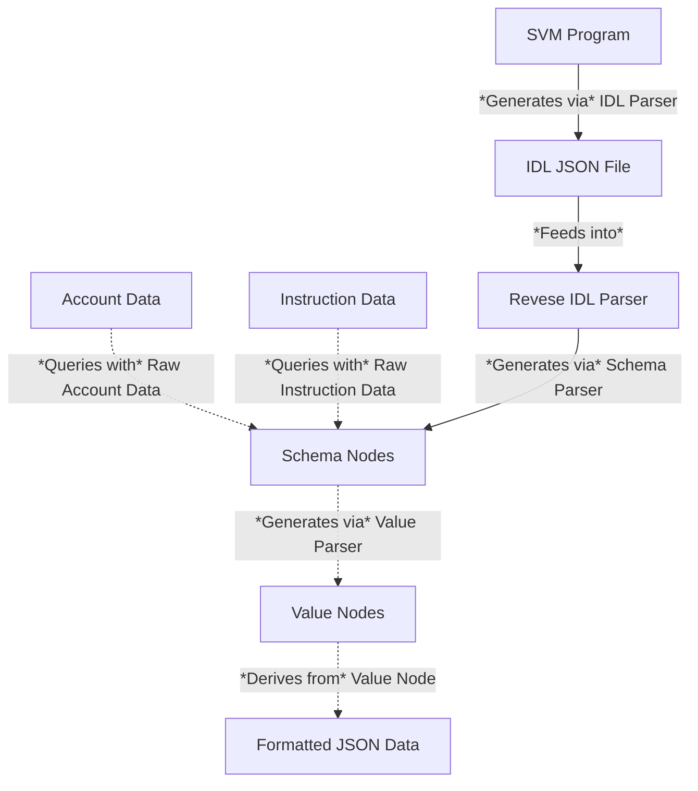

# Atlas IDL Schema

This repo contains a library to transform JSON [IDL](https://en.wikipedia.org/wiki/Interface_description_language) files for Solana programs into normal Rust objects.

### How It Works
The Solana Program IDL pipeline is extremely convoluted. One might even argue that it creates a programming anti-pattern. However, given the prevalence of IDLs for SVM programs, developers should adapt to the situation and develop tooling to make it easier to work with what is available



This library can convert a JSON IDL string into an intermediate Rust `SchemaNode` type. The `SchemaNode` is a recursively defined type that can receive opaque byte object as input and decode those bytes into a `ValueNode` (another recursively defined type). Serializing the `ValueNode` will yield the parsed byte object as human-readable JSON.

### Example

Here's an example of how to read a Drift V2 State account from Solana Mainnet given the Drift IDL file.

```rust
use atlas_idl_schema::parse_idl;
use solana_client::rpc_client::RpcClient;
use std::str::FromStr;

fn main() -> anyhow::Result<()> {
    let drift_idl = parse_idl::parse_idl_file("tests/idls/drift.json")
        .map_err(|e| anyhow::anyhow!("Failed to parse IDL file: {}", e))?;

    let client = RpcClient::new("https://api.mainnet-beta.solana.com".to_string());

    // State
    let account_data = client.get_account_data(
        &solana_sdk::pubkey::Pubkey::from_str("5zpq7DvB6UdFFvpmBPspGPNfUGoBRRCE2HHg5u3gxcsN")
            .unwrap(),
    )?;
    let parsed_account = drift_idl.get_parsed_account(account_data, true)?;
    println!("{}\n", serde_json::to_string(&parsed_account).unwrap());
}
```
